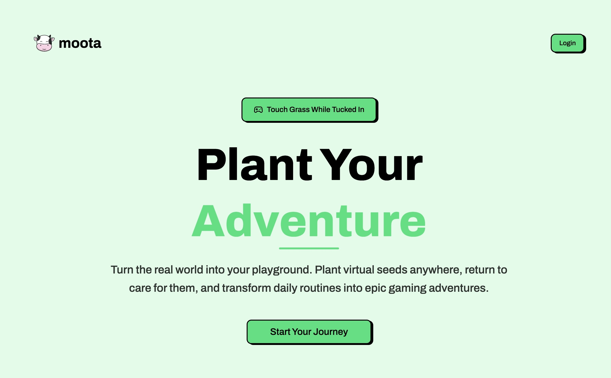

# Moota 🌱

> **Note**: This project is still in development. Expect bugs and breaking changes.

A location-based virtual planting game where you plant seeds at real locations and return to water them. Think of it as a way to make places part of your routine - like that park you jog through or the gym you hit regularly.

Try it at **[moota.app](https://moota.app)**



## How it works

Plant virtual seeds at locations around you. Each plant has an interaction radius, so you don't need pinpoint GPS accuracy to water them. Skip watering for too long and your plants will slowly lose HP until they die. Different seeds grow into different plants, and soil types affect growth too.

Dead plants? They go to your graveyard. You can also check out other players' plants and profiles.

## Tech Stack

- **Backend**: Go
- **Frontend**: React + TypeScript
- **Database**: PostgreSQL with PostGIS extension

## Setup

### Prerequisites

- Go 1.19+
- Node.js 18+
- Docker
- PostgreSQL with PostGIS
- Caddy (optional, for development proxy)

```bash
git clone https://github.com/jasonuc/moota.git
cd moota

cp .env.sample .env
go mod tidy
make dbu

cd web
pnpm install
cp .env.sample .env.local

make dev
```

The app will be available at:

- **[http://moota.localhost]()** (if using Caddy proxy)
- **[http://localhost:5173]()** (direct frontend access)

## Contributing

Contributions are welcome! Whether it's bug fixes, new features, or improvements - feel free to dive in. Open an issue or submit a PR.

## License

GPL v3
